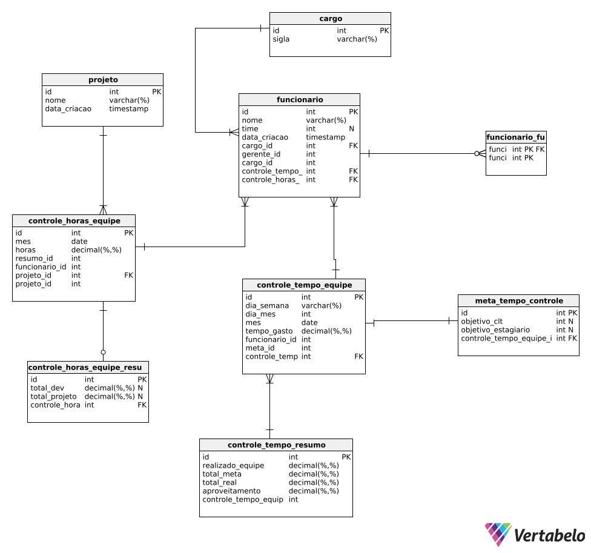

# 📊 Documentação do Banco de Dados

<div align="center">
  
</div>

-----

## 🗂️ Estrutura do Banco

### Modelo Físico - Documentação do Modelo de Dados Físico

**Motor do Banco de Dados:** PostgreSQL
**Versão:** 2.4

-----

### Tabela de Conteúdo

1.  [Tabelas](#tabelas)
      - [cargo](#cargo)
      - [projeto](#projeto)
      - [meta\_tempo\_controle](#meta_tempo_controle)
      - [controle\_horas\_equipe\_resumo](#controle_horas_equipe_resumo)
      - [funcionario](#funcionario)
      - [controle\_tempo\_equipe](#controle_tempo_equipe)
      - [controle\_tempo\_resumo](#controle_tempo_resumo)
      - [controle\_horas\_equipe](#controle_horas_equipe)
      - [funcionario\_funcionario](#funcionario_funcionario)
3.  [Referências](#referencias)
      - [funcionario\_funcionario\_funcionario](#funcionario_funcionario_funcionario)
      - [funcionario\_funcionario\_funcionario\_2](#funcionario_funcionario_funcionario_2)
      - [funcionario\_cargo](#funcionario_cargo)
      - [controle\_tempo\_equipe\_funcionario](#controle_tempo_equipe_funcionario)
      - [controle\_tempo\_equipe\_controle\_tempo\_resumo](#controle_tempo_equipe_controle_tempo_resumo)
      - [controle\_horas\_equipe\_funcionario](#controle_horas_equipe_funcionario)
      - [controle\_horas\_equipe\_projeto](#controle_horas_equipe_projeto)
      - [meta\_tempo\_controle\_controle\_tempo\_equipe](#meta_tempo_controle_controle_tempo_equipe)
      - [controle\_horas\_equipe\_resumo\_controle\_horas\_equipe](#controle_horas_equipe_resumo_controle_horas_equipe)
4.  [Sequências](#sequences)

-----

### Tabelas

#### cargo

  - **Descrição:** Armazena os diferentes cargos de funcionários.
  - **Colunas:**
    | Coluna | Tipo | Propriedades | Descrição |
    | :--- | :--- | :--- | :--- |
    | `id` | int | PK | Chave primária. Auto-incrementada, gerada automaticamente. |
    | `sigla` | varchar(%) | | Representa a sigla ou nome do cargo. |

#### projeto

  - **Descrição:** Armazena informações sobre projetos.
  - **Colunas:**
    | Coluna | Tipo | Propriedades | Descrição |
    | :--- | :--- | :--- | :--- |
    | `id` | int | PK | Chave primária. Auto-incrementada, gerada automaticamente. |
    | `nome` | varchar(%) | | Nome do projeto. |
    | `data_criacao` | timestamp | | Data de criação do projeto. O valor é definido automaticamente na criação do registro. |

#### meta\_tempo\_controle

  - **Descrição:** Define metas de tempo para diferentes categorias de funcionários.
  - **Colunas:**
    | Coluna | Tipo | Propriedades | Descrição |
    | :--- | :--- | :--- | :--- |
    | `id` | int | PK | |
    | `objetivo_clt` | int | null | Objetivo de tempo para funcionários CLT. O campo pode ficar em branco. |
    | `objetivo_estagiario`| int | null | Objetivo de tempo para estagiários. O campo pode ficar em branco. |
    | `controle_tempo_equipe_id`| int | | Chave primária. Auto-incrementada, gerada automaticamente. |

#### controle\_horas\_equipe\_resumo

  - **Descrição:** Resumo das horas totais por equipe.
  - **Colunas:**
    | Coluna | Tipo | Propriedades | Descrição |
    | :--- | :--- | :--- | :--- |
    | `id` | int | PK | Chave primária. Auto-incrementada, gerada automaticamente. |
    | `total_dev` | decimal(%,%) | null | Total de horas de desenvolvimento, com 2 casas decimais e valor padrão 0. |
    | `total_projeto`| decimal(%,%) | null | Total de horas do projeto, com 2 casas decimais e valor padrão 0. |
    | `controle_horas_equipe_id`| int | | Chave primária. Auto-incrementada, gerada automaticamente. |

#### funcionario

  - **Descrição:** Tabela central de funcionários.
  - **Colunas:**
    | Coluna | Tipo | Propriedades | Descrição |
    | :--- | :--- | :--- | :--- |
    | `id` | int | PK | Chave primária. Auto-incrementada, gerada automaticamente. |
    | `nome` | varchar(%) | | Nome completo do funcionário. |
    | `time` | int | null | Time ao qual o funcionário pertence. O campo pode ficar em branco. |
    | `data_criacao` | timestamp | | Data de criação do registro do funcionário. |
    | `cargo_id` | int | | ForeignKey(to='relatorios.cargo', on\_delete=SET\_NULL, null=True). Relacionamento: Um Funcionario tem um Cargo (relação muitos-para-um). Comportamento de Exclusão: Se um Cargo for deletado, o campo cargo do funcionário será definido como NULL. |
    | `gerente_id` | int | | Relacionamento: Um Funcionario pode ter um Gerente, que também é um Funcionario (relação de auto-referência). Comportamento de Exclusão: Se um Funcionario (gerente) for deletado, o campo gerente dos seus subordinados será definido como NULL. related\_name: Permite acessar os subordinados de um gerente com gerente.subordinados.all(). |
    | `cargo_id` | int | | Chave primária. Auto-incrementada, gerada automaticamente. |
    | `controle_tempo_equipe_id`| int | | Chave primária. Auto-incrementada, gerada automaticamente. |
    | `controle_horas_equipe_id`| int | | Chave primária. Auto-incrementada, gerada automaticamente. |

#### controle\_tempo\_equipe

  - **Descrição:** Registra o tempo gasto por cada funcionário.
  - **Colunas:**
    | Coluna | Tipo | Propriedades | Descrição |
    | :--- | :--- | :--- | :--- |
    | `id` | int | PK | Chave primária. Auto-incrementada, gerada automaticamente. |
    | `dia_semana` | varchar(%) | | Dia da semana em que o tempo foi gasto. |
    | `dia_mes` | int | | O dia do mês. |
    | `mes` | date | | O mês em que o registro foi feito. |
    | `tempo_gasto` | decimal(%,%) | | Quantidade de tempo gasto, com 2 casas decimais. |
    | `funcionario_id`| int | | Relacionamento: Cada registro está associado a um Funcionario (relação muitos-para-um). Comportamento de Exclusão: Se um Funcionario for deletado, todos os seus registros de tempo nesta tabela também serão excluídos. |
    | `meta_id` | int | | Relacionamento: O registro pode ser associado a uma MetaTempoControle. Comportamento de Exclusão: Se uma MetaTempoControle for deletada, o campo meta será definido como NULL. |
    | `controle_tempo_resumo_id`| int | | Chave primária. Auto-incrementada, gerada automaticamente. |

#### controle\_tempo\_resumo

  - **Descrição:** Resumo dos valores de controle de tempo.
  - **Colunas:**
    | Coluna | Tipo | Propriedades | Descrição |
    | :--- | :--- | :--- | :--- |
    | `id` | int | PK | Chave primária. Auto-incrementada, gerada automaticamente. |
    | `realizado_equipe`| decimal(%,%) | | Tempo realizado pela equipe. |
    | `total_meta` | decimal(%,%) | | Total de tempo da meta. |
    | `total_real` | decimal(%,%) | | Total de tempo real. |
    | `aproveitamento`| decimal(%,%) | | Porcentagem de aproveitamento. |
    | `controle_tempo_equipe_id`| int | | Relacionamento: Cada resumo está diretamente ligado a um registro de TempoGastoEquipe. Comportamento de Exclusão: Se um registro de tempo gasto for excluído, seu resumo também será. |

#### controle\_horas\_equipe

  - **Descrição:** Controla as horas gastas por funcionário em um projeto específico durante um determinado mês.
  - **Colunas:**
    | Coluna | Tipo | Propriedades | Descrição |
    | :--- | :--- | :--- | :--- |
    | `id` | int | PK | Chave primária. Auto-incrementada, gerada automaticamente. |
    | `mes` | date | | O mês em que as horas foram registradas. |
    | `horas` | decimal(%,%) | | Quantidade de horas gastas. |
    | `resumo_id` | int | | Relacionamento: Pode ter uma relação com a tabela de resumo de horas, mas não é obrigatório. |
    | `funcionario_id`| int | | Relacionamento: Vincula as horas a um Funcionario. Comportamento de Exclusão: Exclui os registros de horas se o funcionário for deletado. |
    | `projeto_id` | int | | Relacionamento: Vincula as horas a um Projeto. Comportamento de Exclusão: Exclui os registros de horas se o projeto for deletado. |
    | `projeto_id` | int | | Chave primária. Auto-incrementada, gerada automaticamente. |

#### funcionario\_funcionario

  - **Colunas:**
    | Coluna | Tipo | Propriedades | Descrição |
    | :--- | :--- | :--- | :--- |
    | `funcionario_id`| int | PK | Chave primária. Auto-incrementada, gerada automaticamente. |
    | `funcionario_id`| int | PK | Chave primária. Auto-incrementada, gerada automaticamente. |

-----

### Referências

#### funcionario\_funcionario\_funcionario

  - **Colunas:** `funcionario.id` \<-\> `funcionario_funcionario.funcionario_id`

#### funcionario\_funcionario\_funcionario\_2

  - **Colunas:** `funcionario.id` \<-\> `funcionario_funcionario.funcionario_id`

#### funcionario\_cargo

  - **Descrição:** Um Funcionario tem um Cargo (relação muitos-para-um).
  - **Colunas:** `cargo.id` \<-\> `funcionario.cargo_id`

#### controle\_tempo\_equipe\_funcionario

  - **Descrição:** Cada registro está associado a um Funcionario (relação muitos-para-um).
  - **Colunas:** `controle_tempo_equipe.id` \<-\> `funcionario.controle_tempo_equipe_id`

#### controle\_tempo\_equipe\_controle\_tempo\_resumo

  - **Colunas:** `controle_tempo_resumo.id` \<-\> `controle_tempo_equipe.controle_tempo_resumo_id`

#### controle\_horas\_equipe\_funcionario

  - **Descrição:** Vincula as horas a um Funcionario.
  - **Colunas:** `controle_horas_equipe.id` \<-\> `funcionario.controle_horas_equipe_id`

#### controle\_horas\_equipe\_projeto

  - **Descrição:** Vincula as horas a um Projeto.
  - **Colunas:** `projeto.id` \<-\> `controle_horas_equipe.projeto_id`

#### meta\_tempo\_controle\_controle\_tempo\_equipe

  - **Descrição:** O registro pode ser associado a uma MetaTempoControle.
  - **Colunas:** `controle_tempo_equipe.id` \<-\> `meta_tempo_controle.controle_tempo_equipe_id`

#### controle\_horas\_equipe\_resumo\_controle\_horas\_equipe

  - **Descrição:** Vincula as horas a um Projeto.
  - **Colunas:** `controle_horas_equipe.id` \<-\> `controle_horas_equipe_resumo.controle_horas_equipe_id`

-----

### Sequências

| Nome da Sequência | Início | Descrição |
| :--- | :--- | :--- |
| `cargo_seq` | 1 | |
| `projeto_seq` | 1 | |
| `meta_tempo_controle_seq` | 1 | |
| `controle_horas_equipe_resumo_seq` | 1 | |
| `funcionario_seq` | 1 | |
| `controle_tempo_equipe_seq` | 1 | |
| `controle_tempo_resumo_seq` | 1 | |
| `controle_horas_equipe_seq` | 1 | |

-----

## 📑 Script de Criação

```sql
-- Criação da tabela 'cargo'
CREATE TABLE cargo (
    id BIGSERIAL PRIMARY KEY,
    sigla VARCHAR(20) NOT NULL
);

-- Criação da tabela 'controle_horas_equipe_resumo'
CREATE TABLE controle_horas_equipe_resumo (
    id BIGSERIAL PRIMARY KEY,
    total_dev DECIMAL(6, 2) DEFAULT 0,
    total_projeto DECIMAL(6, 2) DEFAULT 0
);

-- Criação da tabela 'meta_tempo_controle'
CREATE TABLE meta_tempo_controle (
    id BIGSERIAL PRIMARY KEY,
    objetivo_clt VARCHAR(100),
    objetivo_estagirario VARCHAR(100)
);

-- Criação da tabela 'projeto'
CREATE TABLE projeto (
    id BIGSERIAL PRIMARY KEY,
    nome VARCHAR(100) NOT NULL,
    data_criacao DATE NOT NULL DEFAULT CURRENT_DATE
);

-- Criação da tabela 'funcionario'
CREATE TABLE funcionario (
    id BIGSERIAL PRIMARY KEY,
    nome VARCHAR(100) NOT NULL,
    time VARCHAR(100),
    data_criacao DATE NOT NULL DEFAULT CURRENT_DATE,
    cargo_id BIGINT REFERENCES cargo(id) ON DELETE SET NULL,
    gerente_id BIGINT REFERENCES funcionario(id) ON DELETE SET NULL
);

-- Criação da tabela 'controle_tempo_equipe'
CREATE TABLE controle_tempo_equipe (
    id BIGSERIAL PRIMARY KEY,
    dia_semana VARCHAR(10) NOT NULL,
    dia_mes INTEGER NOT NULL CHECK (dia_mes > 0),
    mes DATE NOT NULL,
    tempo_gasto DECIMAL(6, 2) NOT NULL,
    funcionario_id BIGINT NOT NULL REFERENCES funcionario(id) ON DELETE CASCADE,
    meta_id BIGINT REFERENCES meta_tempo_controle(id) ON DELETE SET NULL
);

-- Criação da tabela 'controle_tempo_resumo'
CREATE TABLE controle_tempo_resumo (
    id BIGSERIAL PRIMARY KEY,
    realizado_equipe DECIMAL(6, 2) NOT NULL,
    total_real DECIMAL(6, 2) NOT NULL,
    total_meta DECIMAL(6, 2) NOT NULL,
    aproveitamento DECIMAL(5, 2) NOT NULL,
    controle_tempo_equipe_id BIGINT NOT NULL REFERENCES controle_tempo_equipe(id) ON DELETE CASCADE
);

-- Criação da tabela 'controle_horas_equipe'
CREATE TABLE controle_horas_equipe (
    id BIGSERIAL PRIMARY KEY,
    mes DATE NOT NULL,
    horas DECIMAL(6, 2) DEFAULT 0,
    resumo_id BIGINT REFERENCES controle_horas_equipe_resumo(id) ON DELETE SET NULL,
    funcionario_id BIGINT NOT NULL REFERENCES funcionario(id) ON DELETE CASCADE,
    projeto_id BIGINT NOT NULL REFERENCES projeto(id) ON DELETE CASCADE,
    CONSTRAINT unique_mes_projeto_funcionario UNIQUE (mes, projeto_id, funcionario_id)
);
```

---

## 📑 Script de Insert

```sql
-- 1. Inserção na Tabela 'cargo'
INSERT INTO cargo (sigla) VALUES
('Gerente de Projetos'),
('Membro de Equipe'),
('Lider de Equipe');

-- 2. Inserção na Tabela 'projeto' com data_criacao randômica
INSERT INTO projeto (nome, data_criacao)
SELECT
    nome,
    '2025-01-01'::DATE + (random() * (DATE '2025-12-31' - DATE '2025-01-01'))::INT AS data_criacao
FROM (
    VALUES
        ('SOS Mnt'),
        ('SOS Ges'),
        ('SOS Ed'),
        ('Ball Anal'),
        ('Ball LNO'),
        ('Ball PFS'),
        ('Ball Dados'),
        ('Bayer Mak'),
        ('Incra'),
        ('Climatem'),
        ('Comercial'),
        ('Reunião'),
        ('Projeto A'), -- Adicionando mais alguns para garantir que há variedade
        ('Projeto B'),
        ('Projeto C'),
        ('Projeto D'),
        ('Projeto E'),
        ('Projeto F'),
        ('Projeto G'),
        ('Projeto H'),
        ('Projeto I'),
        ('Projeto J')
) AS projetos(nome);

-- 3. Inserção na Tabela 'meta_tempo_controle'
INSERT INTO meta_tempo_controle (objetivo_clt, objetivo_estagiario) VALUES
('7', '6');

-- 4. Inserção na Tabela 'funcionario'
INSERT INTO funcionario (nome, time, cargo_id, gerente_id, data_criacao) VALUES
('Daniel Maturana', 'Squad A', (SELECT id FROM cargo WHERE sigla = 'Gerente de Projetos'), NULL, CURRENT_DATE),
('Aline Dominique', 'Squad A', (SELECT id FROM cargo WHERE sigla = 'Membro de Equipe'), (SELECT id FROM funcionario WHERE nome = 'Daniel Maturana'), CURRENT_DATE),
('Felipe Faria', 'Squad A', (SELECT id FROM cargo WHERE sigla = 'Membro de Equipe'), (SELECT id FROM funcionario WHERE nome = 'Daniel Maturana'), CURRENT_DATE),
('Eric Lourenço', 'Squad A', (SELECT id FROM cargo WHERE sigla = 'Lider de Equipe'), (SELECT id FROM funcionario WHERE nome = 'Daniel Maturana'), CURRENT_DATE),
('Alison Americo', 'Squad B', (SELECT id FROM cargo WHERE sigla = 'Membro de Equipe'), (SELECT id FROM funcionario WHERE nome = 'Daniel Maturana'), CURRENT_DATE),
('Francisco Bustamante', 'Squad B', (SELECT id FROM cargo WHERE sigla = 'Membro de Equipe'), (SELECT id FROM funcionario WHERE nome = 'Daniel Maturana'), CURRENT_DATE),
('Helena Benevenuto', 'Squad B', (SELECT id FROM cargo WHERE sigla = 'Membro de Equipe'), (SELECT id FROM funcionario WHERE nome = 'Daniel Maturana'), CURRENT_DATE),
('João V Menezes', 'Squad B', (SELECT id FROM cargo WHERE sigla = 'Lider de Equipe'), (SELECT id FROM funcionario WHERE nome = 'Daniel Maturana'), CURRENT_DATE),
('Jose Thomazini', 'Squad C', (SELECT id FROM cargo WHERE sigla = 'Membro de Equipe'), (SELECT id FROM funcionario WHERE nome = 'Daniel Maturana'), CURRENT_DATE),
('Lucas Paiva', 'Squad C', (SELECT id FROM cargo WHERE sigla = 'Lider de Equipe'), (SELECT id FROM funcionario WHERE nome = 'Daniel Maturana'), CURRENT_DATE),
('Sérgio Casas', 'Squad C', (SELECT id FROM cargo WHERE sigla = 'Membro de Equipe'), (SELECT id FROM funcionario WHERE nome = 'Daniel Maturana'), CURRENT_DATE);

-- 5. Inserção na Tabela 'controle_tempo_equipe'
INSERT INTO CONTROLE_TEMPO_EQUIPE (
    DIA_SEMANA,
    DIA_MES,
    MES,
    FUNCIONARIO_ID,
    TEMPO_GASTO,
    META_ID
)
SELECT
    TRIM(TO_CHAR(D, 'Day')) AS DIA_SEMANA,
    EXTRACT(DAY FROM D)::INT AS DIA_MES,
    DATE_TRUNC('month', D)::DATE AS MES,
    F.id AS FUNCIONARIO_ID,
    ROUND(
        CASE
            WHEN EXTRACT(DOW FROM D) IN (0,6) THEN 0
            WHEN F.id % 2 = 0 THEN (4 + RANDOM() * 2)::NUMERIC
            ELSE (6 + RANDOM() * 3)::NUMERIC
        END
    , 1) AS TEMPO_GASTO,
    CASE
        WHEN F.id % 2 = 0 THEN (SELECT id FROM meta_tempo_controle WHERE objetivo_estagiario = '6')
        ELSE (SELECT id FROM meta_tempo_controle WHERE objetivo_clt = '7')
    END AS META_ID
FROM
    GENERATE_SERIES('2025-01-01'::DATE, '2025-12-31'::DATE, '1 day') D
    CROSS JOIN funcionario F
ORDER BY
    D,
    F.id;

-- 6. Inserção na Tabela 'controle_tempo_resumo'
INSERT INTO controle_tempo_resumo (
    realizado_equipe,
    total_real,
    total_meta,
    aproveitamento,
    controle_tempo_equipe_id
)
SELECT
    c.tempo_gasto AS realizado_equipe,
    c.tempo_gasto AS total_real,
    CASE
        WHEN mtc.objetivo_clt = '7' THEN 154.0
        WHEN mtc.objetivo_estagiario = '6' THEN 132.0
        ELSE 0
    END AS total_meta,
    CASE
        WHEN c.tempo_gasto > 0 THEN
            ROUND((c.tempo_gasto /
                CASE
                    WHEN mtc.objetivo_clt = '7' THEN 154.0
                    WHEN mtc.objetivo_estagiario = '6' THEN 132.0
                    ELSE 1
                END) * 100, 2)
        ELSE 0
    END AS aproveitamento,
    c.id AS controle_tempo_equipe_id
FROM
    controle_tempo_equipe c
JOIN
    meta_tempo_controle mtc ON c.meta_id = mtc.id
WHERE
    c.tempo_gasto > 0;

-- 7. Geração e Inserção para 'controle_horas_equipe_resumo' e 'controle_horas_equipe'
WITH TotalHorasFuncionarioMes AS (
    SELECT
        DATE_TRUNC('month', mes)::DATE AS mes_referencia,
        funcionario_id,
        SUM(tempo_gasto) AS total_horas
    FROM
        controle_tempo_equipe
    WHERE
        EXTRACT(DOW FROM mes) NOT IN (0,6) AND tempo_gasto > 0
    GROUP BY
        DATE_TRUNC('month', mes), funcionario_id
),
HorasDistribuidaPorProjeto AS (
    SELECT
        thfm.mes_referencia,
        thfm.funcionario_id,
        proj.id AS projeto_id,
        ROUND( (thfm.total_horas * (RANDOM() * 0.7 + 0.3))::numeric, 2 ) AS horas_parciais
    FROM
        TotalHorasFuncionarioMes thfm,
        (SELECT id FROM projeto ORDER BY RANDOM() LIMIT (1 + (RANDOM() * 7)::INT)) AS proj(id)
),
HorasFinaisPorFuncionarioProjetoMes AS (
    SELECT
        hdp.mes_referencia,
        hdp.funcionario_id,
        hdp.projeto_id,
        SUM(hdp.horas_parciais) AS horas_trabalhadas
    FROM
        HorasDistribuidaPorProjeto hdp
    GROUP BY
        hdp.mes_referencia, hdp.funcionario_id, hdp.projeto_id
),
TotaisMensaisResumo AS (
    SELECT
        mes_referencia,
        SUM(horas_trabalhadas) AS total_dev_no_mes,
        SUM(horas_trabalhadas) AS total_projeto_no_mes
    FROM
        HorasFinaisPorFuncionarioProjetoMes
    GROUP BY
        mes_referencia
),
ResumosMensaisGerados AS (
    INSERT INTO controle_horas_equipe_resumo (total_dev, total_projeto)
    SELECT
        tmr.total_dev_no_mes,
        tmr.total_projeto_no_mes
    FROM
        TotaisMensaisResumo tmr
    ORDER BY
        tmr.mes_referencia
    RETURNING id, total_dev, total_projeto, CURRENT_DATE AS mes_referencia
)
INSERT INTO controle_horas_equipe (mes, horas, funcionario_id, projeto_id, resumo_id)
SELECT
    hfp.mes_referencia AS mes,
    hfp.horas_trabalhadas AS horas,
    hfp.funcionario_id,
    hfp.projeto_id,
    (SELECT r.id FROM ResumosMensaisGerados r ORDER BY RANDOM() LIMIT 1) AS resumo_id
FROM
    HorasFinaisPorFuncionarioProjetoMes hfp;

```